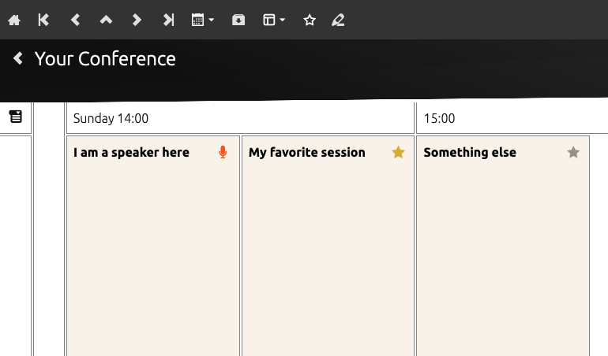
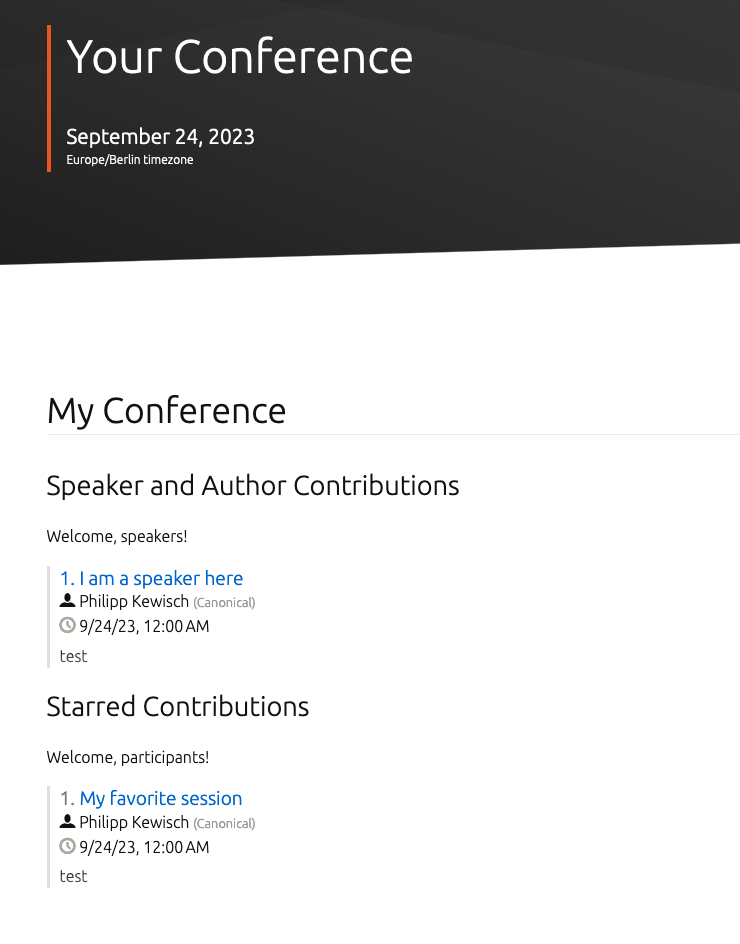
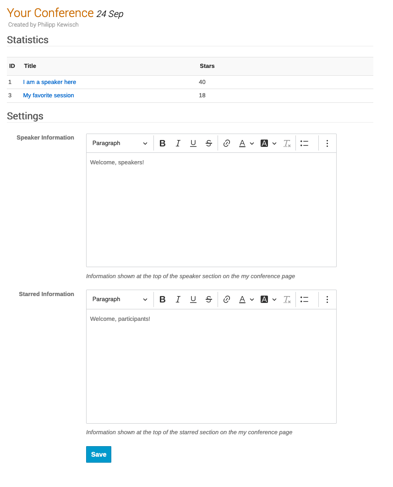

Personal Agenda for Indico
==========================

This plugin adds the possibility for conference participants to star their favorite sessions and
build an agenda for their conference. It also gives event managers the opportunity to see which
contributions have received the most stars.

It works best in combination with the
[NGTimetable](https://github.com/canonical/canonical-indico-ngtimetable) plugin.

Setup
-----

After installing the plugin, be sure to run the database upgrade script. Make sure you have the
indico python environment activated.

```
indico db --plugin personal_agenda upgrade
```

Further configuration occurs in the respective event management interface.

Participant Features
--------------------
If NGTimetable is installed, participants can star contributions directly on the timetable. If they
are a speaker, their contribution will show with a special icon. Additionally, in the menu there is
an option to show only starred (and speaker) contributions.




As participants star sessions, they build their conference agenda. This special page will show all
sessions they are involved in as a speaker or author, and their list of starred sessions.



Management Features
-------------------
In the event management settings, you can determine a text that  shows on the my conference
dashboard, e.g. to welcome speakers or provide some encouraging words for the personal agenda.

Additionally, it is recommended to hide the built-in "My Conference" menu link to avoid duplicate
items showing in the list. You may also hide the Author List, Speaker List and Contribution List.


